# 3DGS Reconstruction Quality Report: ktv_hevc_deblur035

**Overall Score**: 46.74/100

**Number of Views Evaluated**: 12

**Render URL**: https://3d-tour-demo-scene.vercel.app/?model=https://storage.googleapis.com/3dgs-homee/ktv_h264hevc.glb&splat=https://storage.googleapis.com/3dgs-homee/ktv_hevc_deblur035.ksplat&px=-3.5&py=0.082&pz=0.38&tx=-2.56&ty=0.007&tz=-0.218

---

## Computer Vision Metrics

### Blur Detection (Laplacian Variance)

- **Quality Score**: 24.09/100

- **Mean Laplacian**: 481.80

- **Std Dev**: 199.65

- **Range**: [185.25, 741.63]

*Higher Laplacian variance indicates sharper images.*

### Edge Consistency

- **Consistency Score**: 52.80/100

- **Mean Edge Density**: 0.1008

- **Std Dev**: 0.0236

*Lower standard deviation indicates more consistent edges across views.*

### BRISQUE Quality Assessment

- **Quality Score**: 80.43/100

- **Mean Score**: 80.43

- **Std Dev**: 6.04

*No-reference quality metric based on natural scene statistics.*

---

## Vision Language Model Metrics

**Model**: gpt-5-nano

### Overall Quality Assessment

- **Quality Score**: 48.33/100

- **Mean Rating**: 4.83/10

- **Std Dev**: 0.55

- **Range**: [4.00, 6.00]

### Artifact Detection

- **Quality Score**: 40.83/100

- **Mean Severity**: 6.92/10

- **Std Dev**: 0.76

*Lower severity indicates fewer visual artifacts (ghosting, floating blobs, etc.).*

### Structural Quality

- **Quality Score**: 45.83/100

- **Mean Rating**: 4.58/10

- **Std Dev**: 0.64

*Higher rating indicates better structural integrity (no warped walls, misaligned edges, etc.).*

---

## Detailed View Analysis

### View 1 (0°)

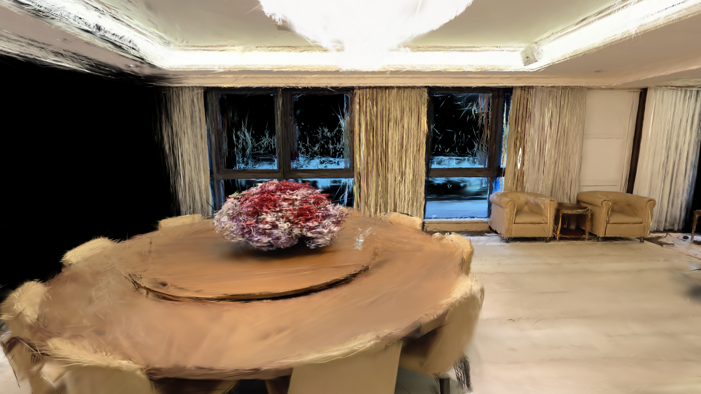

**VLM Analysis**:

**Score**: 5/10

> *The rendering shows moderate structural and textural inconsistencies. Warped geometry, depth ambiguities, and notable texture artifacts reduce realism. Overall, it resembles a 3D reconstruction with significant perceptual errors rather than a faithful real scene.*

**Detected Issues**:
- ⚠️ **Curved Or Warped Walls**: Clear warping and bending along wall/ceiling regions, especially near the windows and table edge.
- ⚠️ **Misaligned Edges**: Edges between furniture and walls appearsoftened and slightly misaligned; corners do not lock sharply.
- ⚠️ **Depth Or Perspective Errors**: Depth cues look inconsistent; large black region on left suggests missing geometry and abrupt cut-off, affecting perspective.
- 🎨 **Ghosting**: Subtle double-edge effects around shiny surfaces and curtains.
- 🎨 **Over Blur**: Excessive blur/softening across most surfaces reduces fine texture fidelity.
- 🎨 **Texture Inconsistency**: Inconsistent texture detail across surfaces (table vs. walls vs. upholstery) with unnatural specular behavior.

### View 2 (30°)

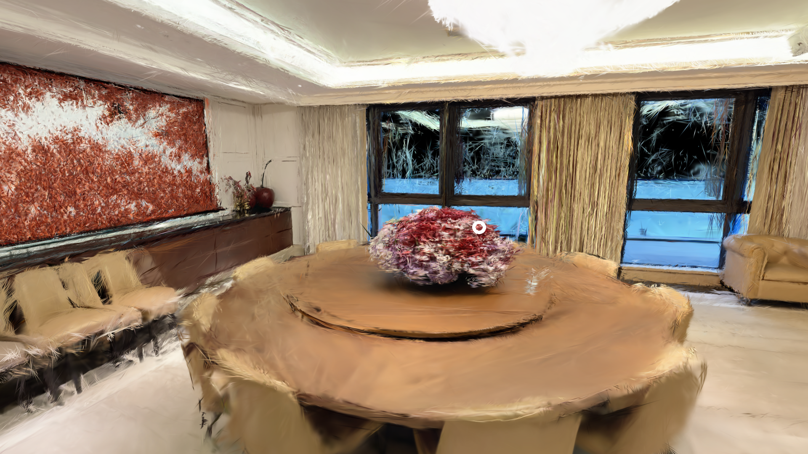

**VLM Analysis**:

**Score**: 5/10

> *The reconstruction shows a plausible interior layout with correct surface arrangements, but geometric fidelity is compromised by strong painterly distortion and depth ambiguity. Textures are blur-affected and exhibit inconsistency across surfaces, reducing realism. Overall, it's identifiable as a 3DGS-like render with notable geometric and texture artifacts that prevent it from matching a real scene closely.*

**Detected Issues**:
- ⚠️ **Curved Or Warped Walls**: Ceiling and wall planes appear overly distorted with painterly warping, especially near the ceiling edge and along the left wall panel.
- ⚠️ **Misaligned Edges**: Window/door frames and some furniture edges do not align cleanly, leading to subtle structural mismatches at joints.
- ⚠️ **Depth Or Perspective Errors**: Depth cues are softened; some foreground elements blend with background, reducing precise spatial separation (e.g., table edge vs floor).
- 🎨 **Ghosting**: Faint double-edges and smeared textures in reflective surfaces and fabric areas.
- 🎨 **Over Blur**: Overall scene appears heavily blurred, washing out fine details and reducing crispness of textures.
- 🎨 **Texture Inconsistency**: Inconsistent texture quality across surfaces (wood, fabric, and walls) with abrupt transitions.

### View 3 (60°)

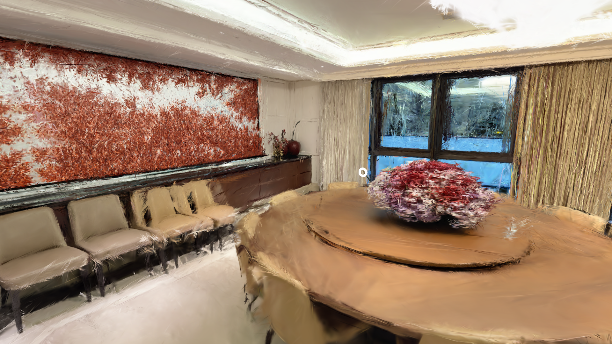

**VLM Analysis**:

**Score**: 4/10

> *The rendering shows a recognizably plausible room layout but suffers from strong geometric distortions and varying texture fidelity. Structural geometry is inconsistent with real-world cues (curved walls, smeared edges, depth ambiguities). Texture artifacts such as ghosting and over-blur reduce realism and hinder surface detail. Overall, a reconstruction with several noticeable artifacts that prevent it from being mistaken for a real photograph, warranting a low-to-mid score.*

**Detected Issues**:
- ⚠️ **Curved Or Warped Walls**: Walls and large surfaces show pronounced curvature and non-Euclidean deformation, particularly along the long wall with the red artwork and the ceiling region.
- ⚠️ **Misaligned Edges**: Edge alignment is inconsistent in several areas: chair backs and table rim blur into surrounding surfaces, creating broken or jagged edges.
- ⚠️ **Depth Or Perspective Errors**: Perspective cues are inconsistent across surfaces; near the window the depth relationship appears smeared, reducing depth cue reliability.
- 🎨 **Ghosting**: Persistent ghost-like traces around furniture and decorative elements, indicating temporal blending or multi-surface artifacts.
- 🎨 **Over Blur**: Excessive blur across most surfaces, obscuring fine texture such as upholstery and tabletop details.
- 🎨 **Texture Inconsistency**: Texture quality varies abruptly between surfaces (wood, fabric, glass) suggesting inconsistent sampling or shading.

### View 4 (90°)

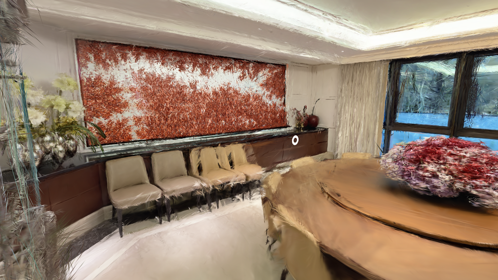

**VLM Analysis**:

**Score**: 5/10

> *The rendering shows a recognizable interior layout but with notable geometric distortions and depth inconsistencies. There are strong texture artifacts including over-blur and patchy texture regions, along with misaligned edges and warped walls that reduce realism. Overall, it is a mid-grade reconstruction with several structural and texture issues that prevent it from being a reliable real-world depiction.*

**Detected Issues**:
- ⚠️ **Curved Or Warped Walls**: Wall surfaces appear bent and irregular, particularly along the back wall where the red panel is; overall geometry looks distorted.
- ⚠️ **Misaligned Edges**: Edges of furniture and cabinet alignments do not meet cleanly; some chair legs and countertop edges appear offset or slanted.
- ⚠️ **Depth Or Perspective Errors**: Depth cues are inconsistent, with foreground curved table dominating perception and background elements mis-scaled, indicating perspective errors.
- 🎨 **Floating Artifacts**: Patchy texture areas and smeared regions near the wall and on the tabletop suggest floating texture fragments.
- 🎨 **Over Blur**: Widespread motion-like blur reduces surface detail and sharpness, especially on chairs and table edges.
- 🎨 **Texture Inconsistency**: Inconsistent texture fidelity across surfaces (fabric chairs vs. wood cabinet) with abrupt transitions.

### View 5 (120°)

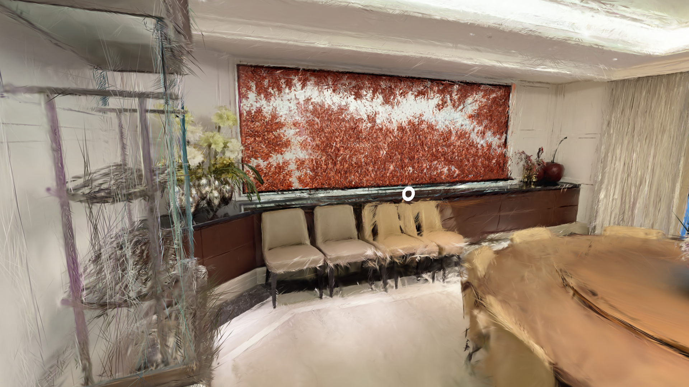

**VLM Analysis**:

**Score**: 5/10

> *The rendering shows a recognizable indoor scene with coherent composition, but exhibits significant geometric and texture inconsistencies. Warped walls, perspective distortions, ghosting, and scattered noise reduce realism. Overall suitability as a 3D reconstruction is moderate; improvements needed in depth accuracy and texture fidelity.*

**Detected Issues**:
- ⚠️ **Curved Or Warped Walls**: Subtle warping along walls and edge regions, particularly near the left scaffolding and back wall.
- ⚠️ **Depth Or Perspective Errors**: Visible perspective distortion and depth cue inconsistencies, especially around the foreground table and seating area.
- 🎨 **Ghosting**: Fine ghosting/ghost-like inklings around high-contrast areas (red panel) and mesh lines.
- 🎨 **Floating Artifacts**: Sparse stray strands and lines drifting above surfaces, resembling floating noise.
- 🎨 **Over Blur**: Overall softening and motion-blur effect reducing detail in textures.
- 🎨 **Texture Inconsistency**: Inconsistent material cues between wall, furniture, and foreground object textures.

### View 6 (150°)

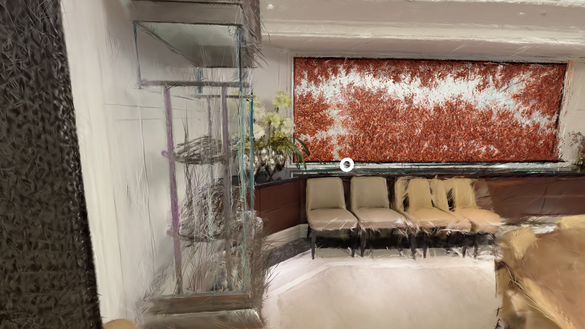

**VLM Analysis**:

**Score**: 5/10

> *The rendering shows notable geometric and texture inconsistencies typical of aggressive 3D Gaussian splatting reconstructions: distorted geometry, misaligned edges, depth errors, and pervasive texture artifacts reduce realism and structural integrity. The scene is not convincingly plausible as a real-world interior.*

**Detected Issues**:
- ⚠️ **Curved Or Warped Walls**: Wall and surface planes appear heavily warped with irregular curves and bending lines, not matching a real room geometry.
- ⚠️ **Misaligned Edges**: Edges of furniture and architectural elements do not align with a coherent perspective; joints and borders look skewed.
- ⚠️ **Depth Or Perspective Errors**: Depth cues and scale are inconsistent; foreground furniture and background elements do not follow a consistent perspective, creating a distorted depth impression.
- 🎨 **Ghosting**:  faint double outlines around objects and textures, indicating temporal/space inconsistencies.
- 🎨 **Floating Artifacts**:  stray wisps and lines not attached to surfaces, giving a floaty feel to parts of the frame.
- 🎨 **Over Blur**:  overall image appears smeared, reducing fine texture fidelity.
- 🎨 **Texture Inconsistency**:  surface textures do not maintain uniform detail; some areas look stretched or smeared compared to others.

### View 7 (180°)

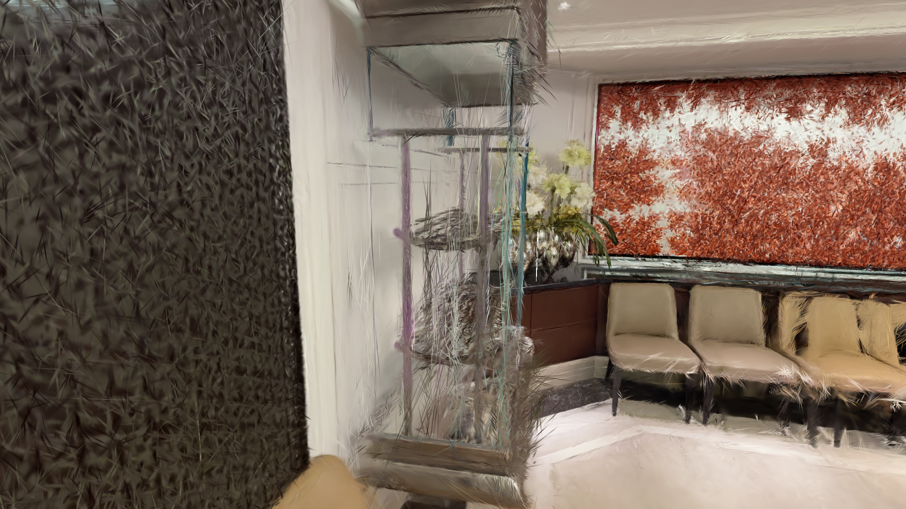

**VLM Analysis**:

**Score**: 6/10

> *The rendering shows a generally coherent interior layout with recognizable furniture and decor. However, noticeable geometric distortions (curved/warped walls, misaligned edges) and multiple texture artifacts (ghosting, floating strands) reduce realism. Depth cues are imperfect, affecting spatial consistency. Overall, a moderately plausible reconstruction with several strict artifacts that prevent near-photorealism.*

**Detected Issues**:
- ⚠️ **Curved Or Warped Walls**: Walls and furniture edges appear distorted with wavy outlines, especially along the left textured wall and shelving unit.
- ⚠️ **Misaligned Edges**: Some shelf frames and vertical supports do not perfectly align with the wall plane, causing slight gaps.
- ⚠️ **Depth Or Perspective Errors**: Depth cues are inconsistent in places (foreground vs background) leading to mild perspective distortion around the seating area.
- 🎨 **Ghosting**: Fine strands and sheens appear across surfaces, resembling motion or temporal ghosting.
- 🎨 **Floating Artifacts**: Sparse translucent strands float in front of furniture and walls, not tied to geometry.
- 🎨 **Texture Inconsistency**: Texture transitions between wall, furniture, and floor are abrupt, with patchy detail.

### View 8 (210°)

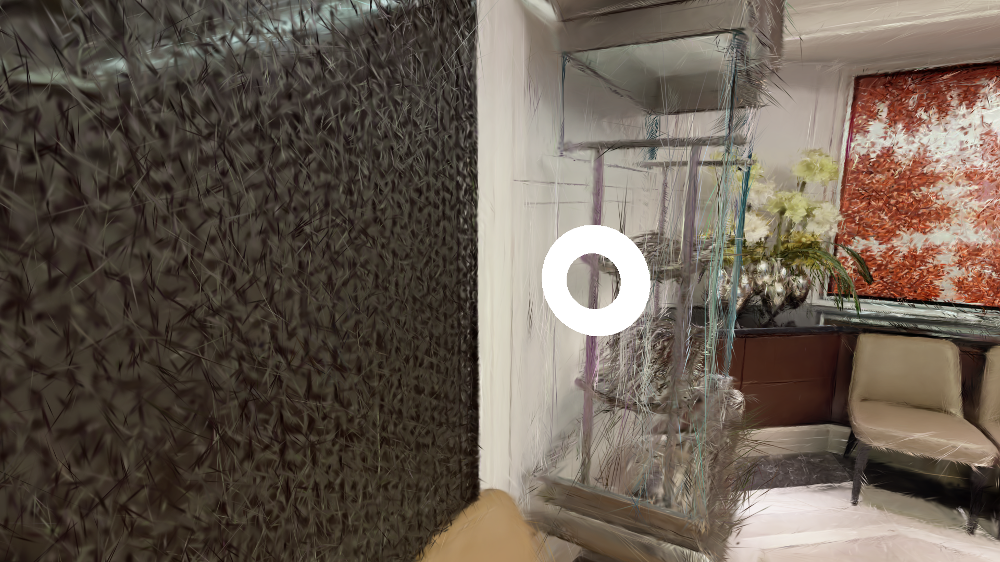

**VLM Analysis**:

**Score**: 5/10

> *The rendering exhibits notable geometric and perspective distortions, with warped walls and misaligned edges that reduce realism. Texture fidelity is inconsistent, with over-blurred areas and floating artifacts contributing to a sense of instability in the scene. Overall, the reconstruction is only moderately convincing as a real-world interior but contains several decisive geometric and texture issues that break spatial coherence.*

**Detected Issues**:
- ⚠️ **Curved Or Warped Walls**: Large left wall appears heavily curved and warped; overall room geometry lacking correct planar structure.
- ⚠️ **Misaligned Edges**: Edges of furniture and wall panels do not align correctly; vertical/horizontal lines are inconsistent.
- ⚠️ **Depth Or Perspective Errors**: Unnatural perspective shifts and inconsistent depth cues, especially around the central vertical elements and far wall.
- 🎨 **Floating Artifacts**: Sparse stray line artifacts and faint translucent shapes drifting near the central structure.
- 🎨 **Over Blur**: Overall softness with some areas blurred more than expected for a high-detail interior.
- 🎨 **Texture Inconsistency**: Different surfaces (wall, furniture, window treatment) show inconsistent texture fidelity and noise levels.

### View 9 (240°)

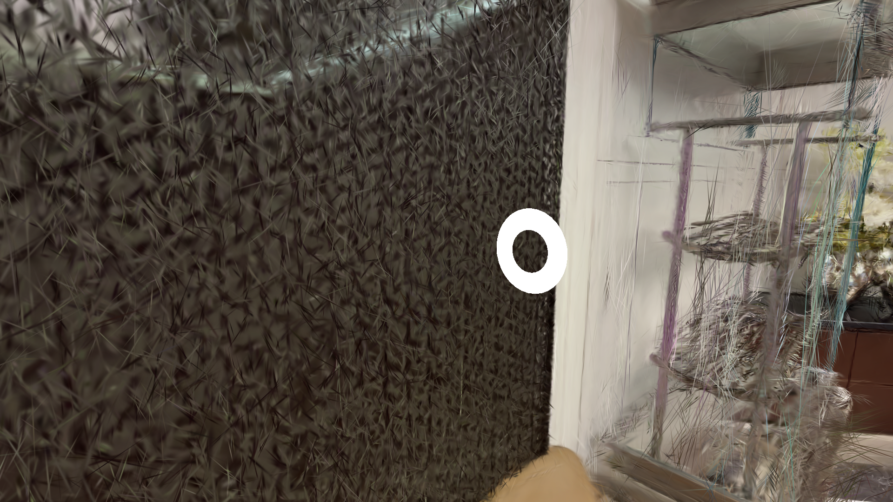

**VLM Analysis**:

**Score**: 4/10

> *The rendering shows several geometric and textural inconsistencies typical of a faulty 3D Gaussian splatting reconstruction: warped wall regions, misaligned edges, inconsistent depth cues, and texture artifacts (floating elements, over-blur, and abrupt texture changes). Overall realism is limited with multiple noticeable defects reducing plausibility as a real scene.*

**Detected Issues**:
- ⚠️ **Curved Or Warped Walls**: Left wall area displays irregular, non-planar surface with heavy directional aliasing, suggesting warped geometry.
- ⚠️ **Misaligned Edges**: Edges between wall and floor/ceiling appear jagged and misaligned, lacking clean continuity.
- ⚠️ **Depth Or Perspective Errors**: Overall perspective feels inconsistent; scale and depth cues do not align plausibly with scene geometry.
- 🎨 **Floating Artifacts**: Thin stray strands and scribbles float over surfaces, particularly on the right scaffold area.
- 🎨 **Over Blur**: Some surfaces appear overly smooth or blurred, reducing texture fidelity.
- 🎨 **Texture Inconsistency**: Textures vary abruptly between surfaces (dark wall vs. interior) with inconsistent tiling and shading.

### View 10 (270°)

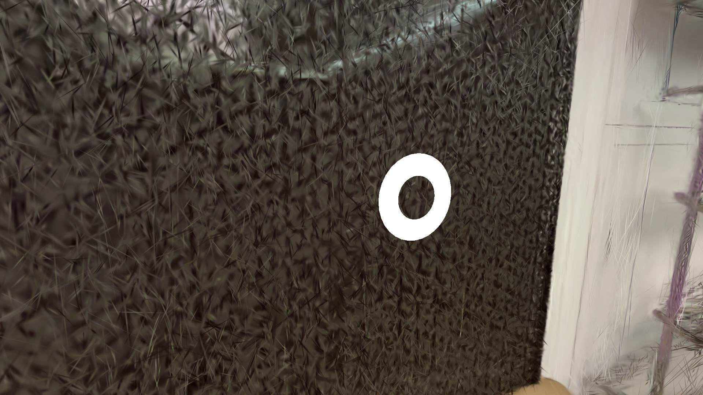

**VLM Analysis**:

**Score**: 5/10

> *The rendering shows a dense, irregular texture on a wall-like surface with questionable depth cues and notable texture artifacts. While the overall structure resembles a large planar surface, curvature, depth ambiguity, and ghosting/blur reduce realism and geometric fidelity. Likely a coarse 3DGS/Nerf-like reconstruction with limited perspective accuracy and inconsistent texturing across the surface.*

**Detected Issues**:
- ⚠️ **Curved Or Warped Walls**: Wall appears slightly curved or warped due to perspective and dense texture; geometry does not form a perfectly flat surface.
- ⚠️ **Depth Or Perspective Errors**: Ambiguity in depth cues near the edge; some transitions look flattened or stretched, affecting proper perspective understanding.
- 🎨 **Ghosting**: Overlapping veil-like patterns on the textured surface, suggesting render- or sampling-induced ghosting.
- 🎨 **Over Blur**: Diffuse blur across dense texture regions reduces sharpness of micro-details.
- 🎨 **Texture Inconsistency**: Inconsistent texture density and tone across the surface; some areas look more smeared than others.

### View 11 (300°)

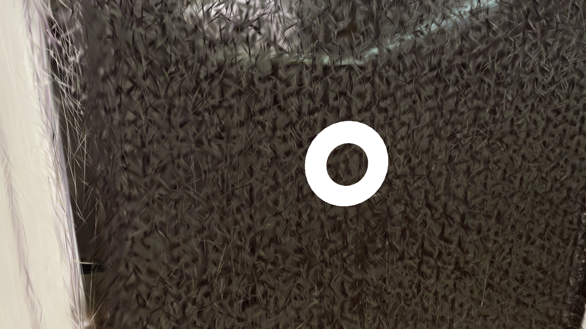

**VLM Analysis**:

**Score**: 5/10

> *The rendering shows a highly noisy, non-uniform surface with ambiguous depth and jagged geometry. There is a distracting floating ring artifact overlaying the scene, and texture coherence is inconsistent across the surface. Overall realism is limited by structural irregularities and severe depth cues issues.*

**Detected Issues**:
- ⚠️ **Curved Or Warped Walls**: Dense, irregular mesh with numerous sharp, spiky fragments across the surface giving a chaotic, non-planar appearance.
- ⚠️ **Misaligned Edges**: Edges appear jagged and inconsistent, suggesting broken surface connectivity in several regions.
- ⚠️ **Depth Or Perspective Errors**: Lack of coherent depth cues and uniform shading indicate depth ambiguity and perspective inconsistencies.
- 🎨 **Floating Artifacts**: A bright circular ring overlay (not part of the scene) appears to float in front of the surface, disrupting realism.
- 🎨 **Texture Inconsistency**: Texture detail varies abruptly across the surface; some regions look smoother while others are highly faceted.

### View 12 (330°)

**VLM Analysis**:

**Score**: 4/10

> *The render shows a dense, fur-like texture with unclear depth and several edge misalignments. Depth cues are inconsistent, and texturing varies between regions, indicating notable reconstruction artifacts. Overall realism is limited with several geometric and texture discrepancies.*

**Detected Issues**:
- ⚠️ **Misaligned Edges**: Rough seam where beige wall meets dark textured surface on the left side
- ⚠️ **Depth Or Perspective Errors**: Unclear depth cues and inconsistent perspective across the dense fur-like region
- 🎨 **Over Blur**: Regions appear overly smoothed, removing fine details of the texture
- 🎨 **Texture Inconsistency**: Inconsistent texturing between wall-like area and fur-like background
